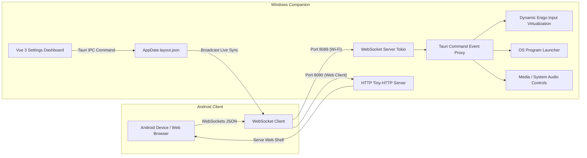

# Android Stream Desk 📱🕹

Turn your old or spare Android device into a professional wireless touch macro pad that controls your Windows PC directly. Runs entirely self-hosted on your local Wi-Fi network (LAN), requires no Internet connection, is fully private, and has extremely low latency (<30ms).

A convenient, ultra-lightweight open-source alternative to expensive physical devices like the Elgato Stream Deck.

Buy me a coffee: https://ko-fi.com/ania9

---

### 📸 Screenshots

| Companion Dashboard UI | Android/Web Client UI |
| :---: | :---: |
|  |  |
| **Settings Configuration (Companion)** | **Settings & Screen Rotation (Client)** |
|  |  |
| **Genshin Theme Sync (Companion)** | **Genshin Theme Sync (Client)** |
|  |  |

---

## 🛠 System Architecture

The system is developed on **a single codebase** using **Tauri v2**, which keeps CPU/RAM usage to a minimum, and consists of 2 main components:



1. **Windows Companion (Server)**:
   - Built with Tauri v2 (Rust backend & Vue 3 + Tailwind CSS v3 frontend).
   - Runs a background WebSocket server on the Tokio runtime, listening on port `8089`.
   - Simulates input using the `enigo` library (a thread-safe variant) to type keystrokes directly on the OS.
   - Launches `.exe` program files directly and adjusts volume or media keys (play/pause/prev/next).
   - Manages and stores the button grid configuration in AppData.

2. **Android App (Client)**:
   - Runs directly on an Android tablet/phone via the Tauri mobile engine.
   - Connects to the PC's WebSocket server via IP address and port.
   - Reads the dynamic grid layout (a CSS Grid that scales from 2x2 to 6x8) and renders the UI instantly to match the PC's configuration.
   - Sends a macro-trigger request back to the PC whenever any button is tapped.

---

## ✨ Key MVP Features

- **Local Network WebSockets**: Connects directly over LAN, with no cloud involved. Includes a heartbeat (Ping/Pong every 5s) and a highly responsive auto-reconnect mechanism every 3 seconds.
- **Dynamic Grid Keypad (CSS Grid)**: Change rows and columns dynamically from the PC Dashboard, with instant Live Sync to the phone.
- **System Shortcut Simulation**: Supports simulating single keys, special keys, and advanced key combinations such as `Ctrl+Shift+Tab`, `Alt+F4`, `Ctrl+S`, etc.
- **Quick App Launcher**: Launches `.exe` executable files directly using plain Windows user privileges, without being blocked by UAC.
- **Convenient Editing Board**: The Dashboard UI lets you pick button background colors, representative emoji, and quickly configure text labels.

---

## 📂 Source Folder Structure

```text
android-stream-desk/
├── src-tauri/
│   ├── Cargo.toml            # Rust dependencies (tungstenite, enigo, serde_json)
│   ├── tauri.conf.json       # Desktop + mobile window permissions & updater plugin
│   ├── capabilities/
│   │   └── default.json      # ACL config allowing shell execute & updater
│   └── src/
│       ├── main.rs           # Launcher entry-point
│       ├── lib.rs            # Rust commands for key/media simulation, app launcher & load/save JSON
│       └── websocket.rs      # Tokio WebSocket server module, port 8089 & heartbeat
├── src/
│   ├── assets/
│   │   └── tailwind.css      # Global custom Tailwind CSS config
│   ├── components/
│   │   ├── ConnectionStatus.vue # Displays connection status & IP input
│   │   ├── GridArea.vue      # Dynamic CSS Grid button layout by rows/cols
│   │   └── GridButton.vue    # Macro button (emoji, label, background)
│   ├── stores/
│   │   ├── connection.ts     # Manages WebSocket client connection & auto-reconnect
│   │   └── layout.ts         # Pinia store for layout persistence, editing & sync
│   ├── views/
│   │   ├── ClientView.vue    # Main interactive UI on Android mobile
│   │   └── DashboardView.vue # Grid editing UI on Windows
│   ├── main.ts               # Setup router & Pinia bootstrap
│   └── App.vue               # Switch layout router
├── package.json              # Declares pnpm dependencies
└── tailwind.config.ts        # Extended CSS theme setup
```

---

## 📥 Download & Quick Install

> No need to build it yourself — download a prebuilt release directly from [**GitHub Releases**](https://github.com/aniadev/android-stream-desk/releases/latest).

### Windows Companion (PC)

1. Go to the [Releases](https://github.com/aniadev/android-stream-desk/releases) page → pick the latest version.
2. Under **Assets**, download the file:
   - `.msi` — recommended, Windows Installer package.
   - `_x64-setup.exe` — NSIS installer (if you can't use the `.msi`).
3. Run the downloaded file and follow the install prompts.
4. Launch **Android Stream Desk** — the app runs in the background in the System Tray.

> **Tag note**: Releases with a `-win` suffix (e.g. `v1.3.2-win`) contain only Windows files, no APK.

### macOS Companion (PC)

Since the macOS release is **unsigned (not notarized by Apple)**, follow these steps to launch it:

1. Go to the [Releases](https://github.com/aniadev/android-stream-desk/releases) page and download the latest `.dmg` file.
2. Open the `.dmg` file and drag the app into the `Applications` folder.
3. Double-click to open the app. The system (Gatekeeper) will show a warning blocking the app from an unidentified developer.
4. **Bypass Gatekeeper**:
   - Go to **System Settings → Privacy & Security**, scroll to the bottom, find the blocked app entry, and choose **Open Anyway**.
   - *Option 2 (via Terminal)*: Run the following command, then open the app normally:
     ```bash
     xattr -dr com.apple.quarantine "/Applications/Android Stream Desk.app"
     ```
5. **Grant macro key permission**: Go to **System Settings → Privacy & Security → Accessibility**, and enable **Android Stream Desk** so it can send simulated system key/click signals.

> **Tag note**: Releases with a `-mac` suffix (e.g. `v1.4.0-mac`) contain only the macOS build.

### Linux Companion (PC)

The app supports running directly via a `.deb` package or a portable `.AppImage`.

1. Go to the [Releases](https://github.com/aniadev/android-stream-desk/releases) page and download the `.deb` or `.AppImage` file.
2. **Installing the `.deb` file**:
   ```bash
   sudo dpkg -i <file_name>.deb
   sudo apt-get install -f # Automatically fixes missing dependency packages (if any)
   ```
3. **Running the `.AppImage` file**:
   ```bash
   chmod +x <file_name>.AppImage
   ./<file_name>.AppImage
   ```
4. **Required system libraries (Runtime dependencies)**:
   The build requires at minimum these system libraries:
   `libwebkit2gtk-4.1-dev`, `libgtk-3-dev`, `libxdo-dev`, `libappindicator3-dev`, `librsvg2-dev`.

> **Wayland Caveat**: The low-level `enigo` key-simulation library works best on the **X11** windowing architecture. On a **pure Wayland** session, simulated system hotkey presses may be restricted. It's recommended to switch your OS login session to **X11** for the best key-simulation performance.

> **Tag note**: Releases with a `-linux` suffix (e.g. `v1.4.0-linux`) contain only the Linux build.

> **USB instead of Wi-Fi**: see [docs/LINUX_USB_MODE.md](docs/LINUX_USB_MODE.md) for a udev + systemd setup that runs `adb reverse` on plug-in. Companion settings live in `server.json`, documented in [docs/CONFIGURATION.md](docs/CONFIGURATION.md).

### Android Client (phone / tablet)

1. Go to the [Releases](https://github.com/aniadev/android-stream-desk/releases) page → pick the latest version.
2. Since v1.5.1, the APK is **split by CPU architecture (ABI)** so each file is much smaller than the old universal build (~33MB instead of ~131MB). Under **Assets**, pick the right file for your device:
   - `android-stream-desk-vX.Y.Z-arm64.apk` — **arm64-v8a (64-bit)**. Choose this for most phones from 2015 onward.
   - `android-stream-desk-vX.Y.Z-arm.apk` — **armeabi-v7a (32-bit)**. For older/budget devices running a 32-bit chip only.
   - The `-unsigned` suffix (e.g. `...-arm64-unsigned.apk`) is an unsigned build (a fallback for when a release has no keystore).
3. On your phone: **Settings** → **Security** → enable **Unknown sources** (or allow it when prompted).
4. Open the downloaded APK file to install it.

#### Which ABI do I need?

> **Quick rule**: almost every device today uses **`-arm64`**. Only download `-arm` if your device is very old, or if `-arm64` reported it couldn't install.

| ABI | File | Example devices |
| :--- | :--- | :--- |
| `arm64-v8a` (64-bit) | `-arm64.apk` | Samsung Galaxy S8/S10/S20/S21/S23/S24, A52/A54; Xiaomi Redmi Note 8/9/10/11/12, POCO; Google Pixel (all models); newer OPPO/Realme/Vivo; OnePlus; Galaxy Tab S6/S7/S8/S9 |
| `armeabi-v7a` (32-bit) | `-arm.apk` | Samsung Galaxy S4/S5, J1/J2/Grand Prime; very old budget Android Go devices; tablets from 2014 or earlier |

> Not sure if your device is 32-bit or 64-bit? Install the **CPU-Z** app (or check **Settings → About phone**) to find out; or just try `-arm64` first — only switch to `-arm` if the system reports "app not compatible".

> **Tag note**: Releases with an `-apk` suffix (e.g. `v1.3.2-apk`) contain only the APK, no Windows files.

---

## 🚀 Setup & Installation Guide

### Prerequisites
- **Node.js**: Version 18+ with the `pnpm` package manager.
- **Rust**: Install via Rustup (supports cargo check and target compilation).
- **Windows Build Tools**: Install the Visual Studio C++ Build Tools (needed to package the Tauri desktop app).
- **Android SDK & NDK**: Set up via Android Studio (needed to package the `.apk` file).

### 1. Running Dev Mode

Install all dependencies and run the Windows Companion server app:
```bash
# 1. Install frontend Node modules
pnpm install

# 2. Launch the Windows Companion server in debug mode
pnpm tauri dev
```
> The custom Dashboard will show at `http://localhost:1420/dashboard` or in the newly opened Desktop window. The mobile Client UI can be tested at `http://localhost:1420/`.

### 2. Building & Packaging (Production Build)

**Packaging the Windows Installer (`.msi` / `.exe`)**:
```bash
pnpm tauri build
```
A compact MSI installer (<10MB), thanks to Rust's optimizations, will be generated at `src-tauri/target/release/bundle/msi/`.

**Packaging the Android Install (`.apk`)**:
```bash
pnpm android:build
```
This command splits the APK by ABI and only builds for real devices (`arm64-v8a` + `armeabi-v7a`, skipping `x86`/`x86_64`, which are emulator-only). Output files land at:
```text
src-tauri/gen/android/app/build/outputs/apk/arm64/release/android-stream-desk-vX.Y.Z-arm64.apk   # arm64-v8a
src-tauri/gen/android/app/build/outputs/apk/arm/release/android-stream-desk-vX.Y.Z-arm.apk       # armeabi-v7a
```

Build a single ABI for speed (recommended when testing, since most newer devices use arm64):
```bash
pnpm android:build:arm64    # arm64-v8a only
```

Manually pick a target if you need a different ABI (short target names per `tauri android build`: `aarch64`, `armv7`, `i686`, `x86_64`):
```bash
pnpm tauri android build --apk --split-per-abi \
  --target aarch64 \      # arm64-v8a (64-bit)
  --target armv7          # armeabi-v7a (32-bit)
```

> **Why split by ABI?** The old universal build packed all 4 ABIs into a single ~131MB APK because the frontend was embedded into every per-ABI `.so`. Splitting by ABI and dropping x86/x86_64 brings each APK down to ~33MB — just download the right file for your device.

---

## 🔒 Non-Functional Requirements (NFR)

- **Local Network Isolation**: The app makes **no** calls to any Internet API. All traffic stays entirely within the LAN over port `8089`. With `loopbackOnly: true` in `server.json` (see [docs/CONFIGURATION.md](docs/CONFIGURATION.md)) the Companion binds `127.0.0.1` only, so nothing on the network can reach it at all; pair that with USB mode ([docs/LINUX_USB_MODE.md](docs/LINUX_USB_MODE.md)).
- **Ideal Transmission Latency**: The latency from sending an action on the Android phone to the keystroke click on the Windows Companion OS averages `15ms` to `30ms` (over a standard 5GHz network connection).
- **Hardened Enigo Logic**: A strict auto-release mechanism for Modifier keys (`Ctrl`, `Alt`, `Shift`, `Win`) after each press is implemented, completely eliminating the possibility of a stuck system hotkey after a click.
